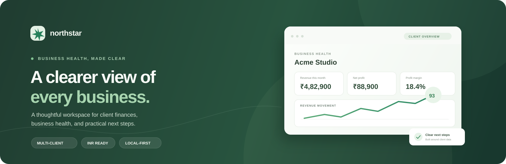

# Northstar — AI Business Health Analyser

<p align="center">
  
</p>

Northstar is a responsive, local-first dashboard for managing client accounts and reviewing their business activity in Indian Rupees (₹). It brings sales, expenses, transactions, cash-flow estimates, and practical growth suggestions into one workspace.

> **Demo and data notice:** Northstar runs entirely in the browser. Client accounts and transactions are saved in that browser’s local storage. The growth coach uses simple rules and saved transaction totals; it does not connect to an AI service. There is no login, shared database, bank connection, or server. Use sample or non-sensitive data only.

## Highlights

- Manage a portfolio of client businesses, with a separate transaction ledger for each account.
- Edit account names, company names, industry, contact details, and opening cash balance.
- Switch between client dashboards; archive and restore accounts without deleting their ledgers.
- Review income, expenses, profit, margin, cash balance estimates, and runway in ₹ INR.
- Add transactions manually or import and export CSV files.
- Filter and search transaction records by type and description.
- See client-specific growth recommendations and a 30/60/90-day action roadmap.
- Ask the built-in growth coach about sales, costs, profit, and cash flow. It is a local rules-based demo assistant, not a live AI chatbot.
- Preview a client-friendly business health report and share a text summary.
- Edit the administrator profile and return to the welcome screen with the log out action.
- Use the interface on desktop and mobile screens.

## Dashboards and sections

| Section | What it shows |
| --- | --- |
| **Client portfolio** | Active client count, portfolio revenue and profit, average health score, and client cards with edit, archive, open, or restore actions. |
| **Accounts** | Account and company names, industry, contact, email, status, revenue, last activity, and account actions. |
| **Client overview** | Health score, recorded revenue and expenses, net profit, margin, estimated cash balance, signals, recent transactions, and quick actions. |
| **Sales dashboard** | Income for the selected period, average sale, income categories, category breakdown, and recent sales. |
| **Cash flow** | Cash in, cash out, net cash flow, estimated runway, and recent cash movements. |
| **Transactions** | Searchable and filterable transaction ledger, manual entry, CSV import/export, delete, and demo reset actions. |
| **Customers** | A lightweight view derived from income descriptions and repeat income records. It is not a customer relationship management system. |
| **Expenses** | Expense totals, category breakdown, and recent outgoing transactions. |
| **AI growth plan** | Client-specific suggestions, evidence from recorded transactions, and a 90-day roadmap. The suggestions are generated by local rules. |
| **Benchmarks** | Illustrative reference points for margin, revenue-to-expense ratio, and income-category diversity. |
| **Settings** | Client workspace details, administrator profile editing, local log out, and transaction reset. |
| **Client report preview** | A clean presentation of the selected client’s current business-health snapshot. |

The reporting-period selector supports **This month**, **This quarter**, and **This year**. Results depend on the dates and amounts recorded for the selected client.

## Run locally

No package manager, build step, or API key is required.

1. Download or clone this repository.
2. Open `index.html` in a modern browser.
3. Select **Open admin workspace** to view the dashboards.

The app is made with plain HTML, CSS, and JavaScript. A local HTTP server can be used if your browser restricts local files, but it is not required for every browser.

## Add and manage client accounts

1. Open **Client portfolio** or **Accounts**.
2. Select **Add client** or **Add account**.
3. Enter an account name and company name. These are separate fields and can be edited later.
4. Add the optional industry, contact information, and opening cash balance.
5. Use the workspace selector or **Open dashboard** to switch to the client.

Each client has an independent transaction list. Editing names and account details does not change the transaction ledger.

## Record a transaction

Select **Add transaction** from the overview or transactions page. Enter:

- **Description:** what the payment was for, such as “Website redesign invoice”.
- **Amount:** the transaction amount in Indian Rupees.
- **Type:** Income or Expense.
- **Category:** a group such as Services, Retainers, Payroll, or Software.
- **Date:** the date the transaction occurred.

Amounts update the selected client’s dashboards and are stored in the current browser.

## CSV import format

Upload a CSV with a header row. The standard column names are:

| Column | Required | Example | Notes |
| --- | --- | --- | --- |
| `Date` | Yes | `2026-10-07` | Use `YYYY-MM-DD` for consistent date parsing. |
| `Description` | Recommended | `Client invoice payment` | Used as the transaction label and in the lightweight customer view. |
| `Type` | Yes | `Income` or `Expense` | Determines whether the amount is cash in or cash out. |
| `Category` | Recommended | `Services` | Used for sales and expense breakdowns. |
| `Amount` | Yes | `45000` | Amount in INR. Commas and a rupee symbol are accepted. |

Example:

```csv
Date,Description,Type,Category,Amount
2026-10-07,Client invoice payment,Income,Services,45000
2026-10-06,Software subscription,Expense,Software,2500
```

The importer also recognizes `Amount INR` and `Transaction` headers. CSV exports include `Date`, `Description`, `Category`, `Type`, and `Amount INR`.

## Growth plan and coach

The growth plan uses the selected client’s transactions to surface rules-based prompts about profitability, expense categories, runway, and income mix. The chat box recognizes common questions about sales, profit, costs, and cash flow and responds with the relevant saved totals and suggested next steps.

No conversation or transaction data is sent to an AI provider. The assistant is not a general-purpose language model, and its suggestions are directional; they do not guarantee business results and are not financial, tax, or accounting advice.

## Data storage and deployment readiness

All data is stored in browser `localStorage`. It does not sync across browsers or devices. Clearing the browser’s site data can remove saved client records and transactions. The starter Acme Studio transactions are fictional sample data.

This repository is a **static demo**, suitable for local review or a static preview. It is not ready to store real client financial information: it has no authentication, authorization, server-side storage, audit trail, backups, or bank integration. A production multi-user product would need secure identity and access controls, protected server-side storage, backup and recovery, and appropriate privacy and legal terms.

To preview it through GitHub Pages or another static site provider, publish the repository’s root directory. This README does not enable hosting or publish the site.

## Project files

```text
.
├── index.html   # Page structure and navigation
├── styles.css   # Responsive layout, components, and visual theme
├── app.js       # Dashboards, client workflows, calculations, local storage, CSV, and coach
├── favicon.svg  # Northstar browser icon
└── README.md    # Project guide and data limitations
```

## License

No license has been added. All rights are reserved by default unless a license is included in the repository.
